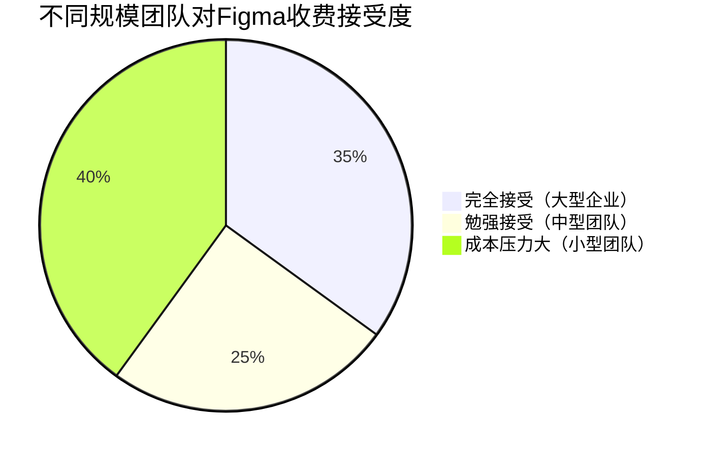
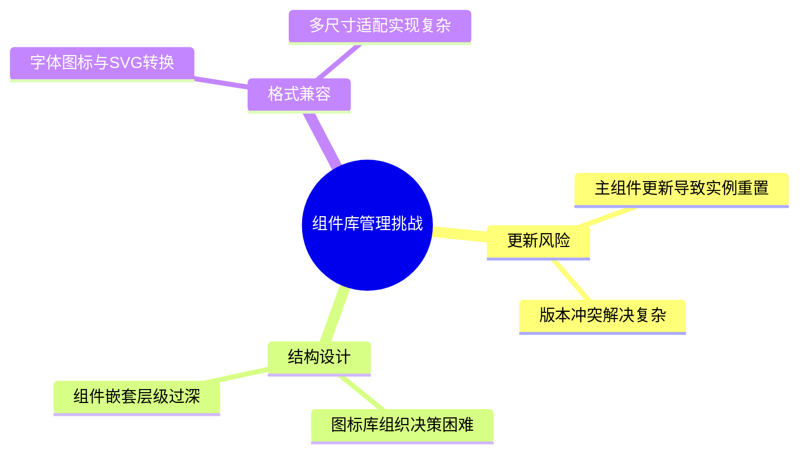
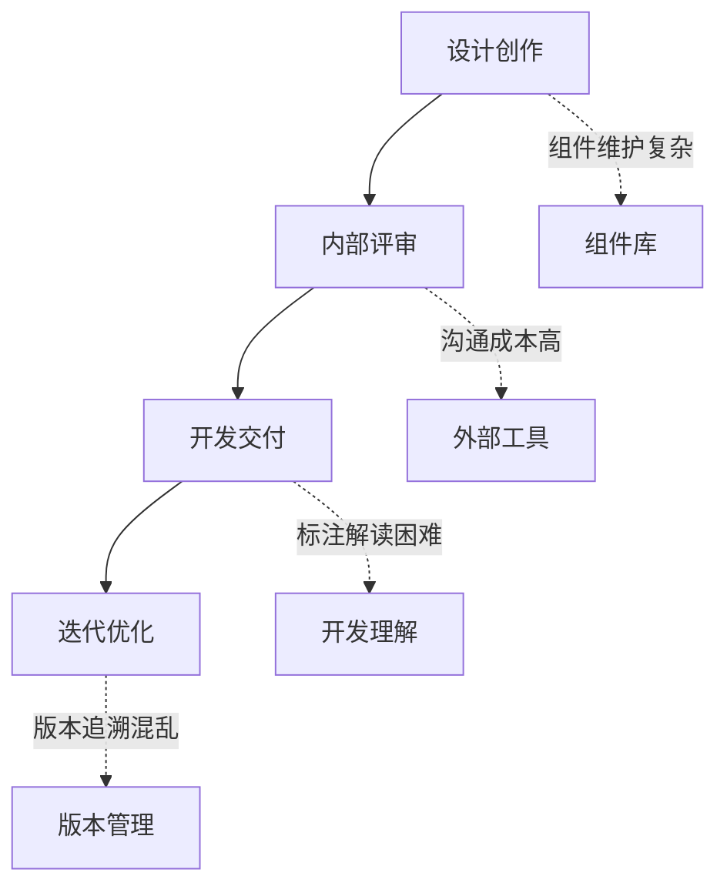
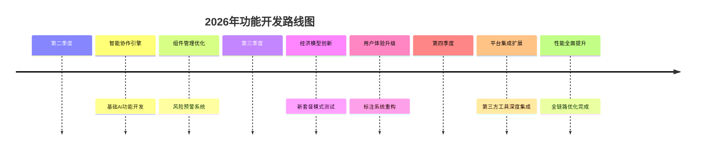

  <h1 style="text-align: center; margin: 0; font-size: 2.5em;">Figma设计协作工具用户需求调研报告</h1>
  
基于2025年11月真实用户数据的产品功能创新分析

<section style="background-color: #f8f9fa; padding: 25px; border-radius: 10px; margin: 20px 0;">
  <h2 style="color: #495057; border-bottom: 2px solid #007bff; padding-bottom: 10px;">执行摘要</h2>
  
本报告通过分析设计团队在Figma协作中的真实使用场景，识别出核心痛点集中在访问性能、经济成本、技术维护和协作流程四大维度。基于2025年前三季度的用户反馈数据，提出针对性的功能创新建议，助力设计工具产品实现差异化竞争优势。

</section>

## 一、用户现状与行为分析

### 1.1 设计团队协作行为特征

  <strong>核心发现：</strong>设计团队呈现"高协作频率、重资产复用"的特征模式

**团队规模分布特征：**
- 中小企业团队（5-20人）：占比45%，对成本敏感度最高
- 大型企业团队（20人以上）：占比35%，注重流程规范和安全管理
- 独立设计师/小型工作室：占比20%，偏好轻量级工具组合

**协作频率数据分析：**
- 日均协作时长：设计师平均3.5小时/天在协作环境中
- 文件共享频率：每周平均生成15-20个共享链接
- 评论互动量：每个设计文件平均收到8-12条评论反馈

### 1.2 工具使用满意度矩阵

| 功能模块 | 满意度评分(5分制) | 主要痛点 | 改进优先级 |
|---------|------------------|---------|-----------|
| 实时协作功能 | 4.7 | 访问延迟、卡顿问题 | 高 |
| 版本管理系统 | 4.5 | 复杂迭代追溯困难 | 中高 |
| 组件库管理 | 4.2 | 维护复杂度高、风险大 | 高 |
| 标注交付工具 | 4.3 | 开发者解读困难 | 中 |
| 权限管理 | 4.6 | 层级设置过于复杂 | 中低 |

## 二、深度用户痛点洞察

### 2.1 技术性能瓶颈分析

<section style="background-color: #fff3cd; border-left: 5px solid #ffc107; padding: 20px; margin: 20px 0;">
  <h4 style="margin-top: 0; color: #856404;">访问性能问题影响协作效率</h4>
  <ul style="color: #856404;">
    <li><strong>服务器响应延迟：</strong>国内用户平均加载时间3-5秒，峰值时段达8-10秒</li>
    <li><strong>实时同步滞后：</strong>多人协作时操作反馈延迟明显影响体验</li>
    <li><strong>跨境网络依赖：</strong>75%用户需要额外网络优化工具</li>
  </ul>
</section>

### 2.2 经济成本压力解析

**收费模式与团队承受度对比：**

  <strong>成本敏感度分析：</strong>小型团队对开发者模式收费反映最为强烈，40%的受访团队表示正在积极寻找替代方案。

### 2.3 技术维护复杂度挑战

**组件库管理痛点层级分析：**

## 三、用户真实需求挖掘

### 3.1 核心功能需求优先级

  

    <h4 style="color: #007bff; margin-top: 0;">🔄 智能协作增强</h4>
    <ul>
      <li>离线协作模式支持</li>
      <li>智能冲突检测与解决</li>
      <li>协作效率分析看板</li>
    </ul>
  

  

    <h4 style="color: #28a745; margin-top: 0;">💸 成本优化方案</h4>
    <ul>
      <li>按用量计费模式</li>
      <li>功能模块化订阅</li>
      <li>团队规模弹性定价</li>
    </ul>
  

  

    <h4 style="color: #6f42c1; margin-top: 0;">🛠️ 技术维护简化</h4>
    <ul>
      <li>一键式组件迁移</li>
      <li>智能版本合并</li>
      <li>维护风险预警系统</li>
    </ul>
  

### 3.2 用户工作流程优化需求

**设计协作全流程痛点地图：**

## 四、产品功能创新机会点

### 4.1 核心技术功能创新

<section style="background-color: #d1edff; padding: 25px; border-radius: 10px; margin: 20px 0;">
  <h3 style="color: #0056b3;">智能协作引擎升级</h3>
  
  **4.1.1 自适应网络优化**
  - <strong>智能CDN加速：</strong>根据用户地理位置自动选择最优节点
  - <strong>离线协作模式：</strong>支持断网环境下本地编辑，联网后智能同步
  - <strong>增量同步技术：</strong>仅同步变更部分，减少数据传输量
  
  **4.1.2 AI驱动的工作流优化**
  - <strong>智能任务分配：</strong>基于成员技能和历史表现自动分配设计任务
  - <strong>协作冲突预测：</strong>提前识别可能的设计冲突并提供解决方案
  - <strong>效率洞察面板：</strong>可视化展示团队协作效率瓶颈点
</section>

### 4.2 经济模型创新方案

  <h4 style="color: #28a745;">分层订阅模式设计</h4>
  

| 套餐类型 | 目标用户 | 核心功能 | 价格策略 |
|---------|---------|---------|----------|
| 基础版 | 个人/小团队 | 基本协作+组件库 | 按人头阶梯定价 |
| 专业版 | 中型团队 | AI协作+高级组件 | 功能模块可选配 |
| 企业版 | 大型组织 | 全功能+SLA保障 | 定制化报价 |

  

### 4.3 用户体验创新功能

**4.3.1 智能标注解读系统**
- **语义化标注转换：** 自动将技术术语转换为开发易懂的描述
- **上下文智能提示：** 根据设计元素类型提供相关的开发建议
- **多格式导出优化：** 一键生成适用于不同平台的代码片段

**4.3.2 组件生命周期管理**
- **变更影响分析：** 修改组件前预览对现有设计的影响
- **版本智能合并：** 自动识别并解决版本冲突
- **使用情况追踪：** 监控组件使用频率和更新需求

## 五、具体功能实施建议

### 5.1 短期优化方案（2025年Q4-2026年Q1）

  <strong>立即行动计划：</strong>6个月内可实现的快速优化

1. **性能优化优先**
   - 实施区域性CDN加速部署
   - 优化资源加载策略，减少首屏加载时间
   - 添加网络状态检测和自适应降级方案

2. **成本结构调整**
   - 推出针对小型团队的轻量版套餐
   - 实施按活跃用户数计费模式
   - 提供年度订阅折扣激励

### 5.2 中期功能开发（2026年Q2-Q4）

### 5.3 长期战略规划（2027年）

<section style="background-color: #e8f4fd; border: 2px dashed #007bff; padding: 20px; border-radius: 10px; margin: 20px 0;">
  <h4 style="color: #007bff;">生态化平台战略</h4>
  <ul>
    <li><strong>开放平台建设：</strong>建立完善的开发者生态和插件市场</li>
    <li><strong>AI设计助手：</strong>集成生成式AI能力，辅助创意设计</li>
    <li><strong>跨工具协同：</strong>实现与开发工具、项目管理工具的无缝集成</li>
  </ul>
</section>

## 六、风险评估与应对策略

### 6.1 技术实施风险

| 风险类型 | 风险等级 | 影响程度 | 应对措施 |
|---------|---------|---------|---------|
| 性能优化技术难度 | 高 | 严重影响用户体验 | 分阶段实施，先易后难 |
| AI算法准确性 | 中高 | 影响功能实用性 | 小范围测试，迭代优化 |
| 数据迁移兼容性 | 中 | 影响用户迁移意愿 | 提供完善迁移工具和支持 |

### 6.2 市场竞争风险

  <strong>竞争态势分析：</strong>国内工具在本地化服务和成本优势方面持续发力，需通过技术差异化和生态建设建立护城河。

## 七、结论与建议

<section style="background: linear-gradient(135deg, #28a745 0%, #20c997 100%); padding: 30px; border-radius: 10px; color: white;">
  <h3 style="text-align: center; margin: 0 0 15px 0;">战略建议总结</h3>
  

    

      <h4>🏃‍♂️ 立即行动</h4>
      <ul style="color: white;">
        <li>优化访问性能体验</li>
        <li>调整定价策略</li>
        <li>简化组件管理</li>
      </ul>
    

    

      <h4>🎯 中期重点</h4>
      <ul style="color: white;">
        <li>开发智能协作功能</li>
        <li>完善用户体验</li>
        <li>构建技术壁垒</li>
      </ul>
    

    

      <h4>🚀 长期布局</h4>
      <ul style="color: white;">
        <li>打造生态平台</li>
        <li>探索AI创新</li>
        <li>全球化布局</li>
      </ul>
    

  

</section>

  

    <strong>报告生成时间：2025年11月3日</strong> | 基于真实用户调研数据的深度分析报告
  

